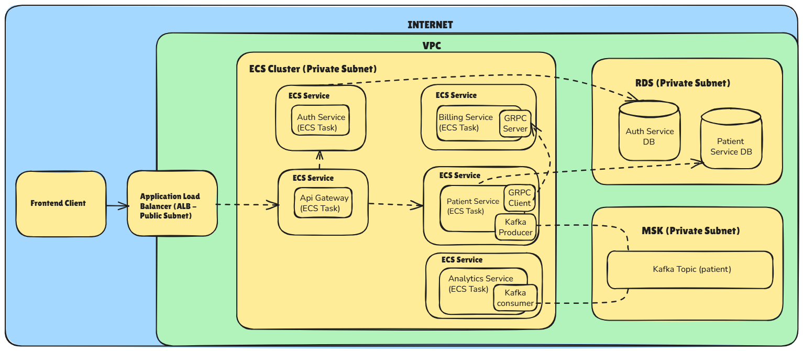

# ClinicPro – Patient Management System

> A Spring Boot microservices backend for patient management using REST, gRPC, Kafka, and JWT.  
> Containerized with Docker and deployed using AWS CDK on LocalStack (ECS, RDS, MSK).  
> The same infrastructure code can also be deployed to real AWS via the generated CloudFormation template.

---

## About

**ClinicPro** is a full-featured backend system designed for independent doctors or small clinics. It streamlines the management of patient records, billing, and analytics using a robust, modular microservices architecture. This project applies modern engineering practices including asynchronous messaging (Kafka), service-to-service communication (gRPC), token-based authentication (JWT), containerization (Docker), and infrastructure-as-code (AWS CDK). It is fully deployable to a simulated AWS environment using LocalStack, or directly to production AWS using the same infrastructure definition.

---

## Architecture Diagram

---

## Microservices Overview

| Service            | Description                                                       |
|--------------------|-------------------------------------------------------------------|
| `auth-service`     | Handles user authentication and JWT generation/validation         |
| `patient-service`  | Manages patient records; communicates with billing and analytics  |
| `billing-service`  | Receives patient data via gRPC and creates billing accounts       |
| `analytics-service`| Kafka consumer that logs patient-related events for reporting     |
| `apis-gateway`     | Spring Cloud Gateway that routes all external API requests        |

---

## Key Features

- Modular microservice architecture using Spring Boot
- Asynchronous event streaming with Kafka (MSK)
- gRPC-based communication between patient and billing services
- JWT authentication with role-based API access
- Infrastructure-as-code using AWS CDK (Java)
- Dockerized services deployed via LocalStack or real AWS
- Integration testing using JUnit

---

## Tech Stack

- Java 21, Spring Boot, Spring Security
- Kafka (MSK), gRPC, REST APIs
- PostgreSQL (RDS)
- Docker & Docker Compose
- AWS CDK (Java)
- LocalStack for AWS simulation
- JUnit for integration testing

---

## Getting Started

> Setup and run instructions will be added soon. All backend services are containerized and deployable via Docker and AWS CDK on LocalStack. The same CDK code can be used for production deployment to AWS.  
> The frontend development (built with React) is currently in progress and will be integrated into this repository soon.

---

## Contact

Created and maintained by **Bhavatarini Thangaraju**  
📧 [LinkedIn](https://www.linkedin.com/in/bhavatarini-thangaraju/) (feel free to connect or message!)
